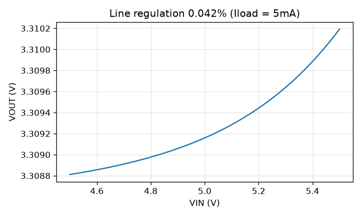
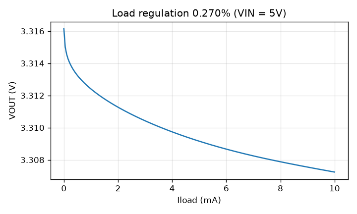
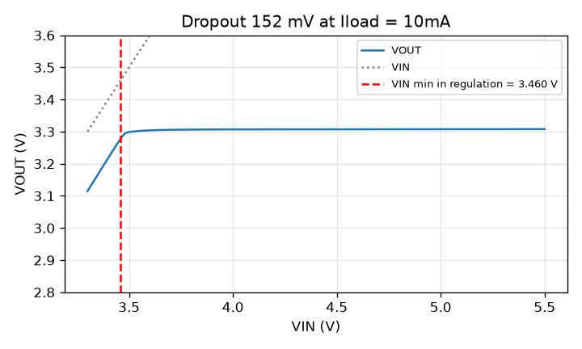
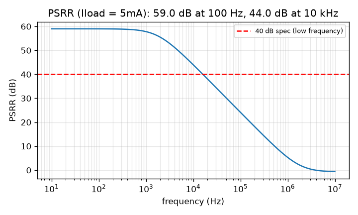
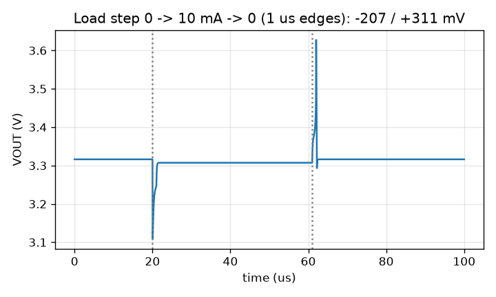
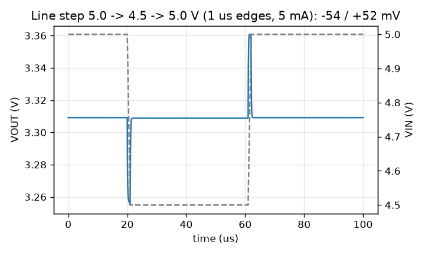
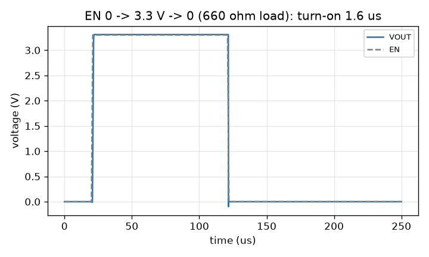
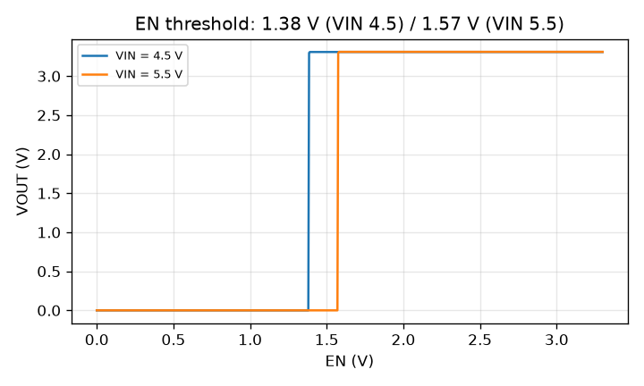

# Simulation results (schematic, pre-layout)

Generated by `simulations/run_sims.py`. Typical corner, 27 C, VIN = 5.0 V, VREF = 1.2 V,
EN = 3.3 V (harness logic level), CL = 2 pF, unless noted.

| Parameter | Spec | Simulated | Result | Testbench |
|---|---|---|---|---|
| Output voltage (5 mA) | 3.201 - 3.399 V | 3.3092 V | PASS | tb_load_reg |
| Dropout (10 mA) | <= 300 mV | 152 mV | PASS | tb_dropout |
| Quiescent current (no load) | <= 100 uA | 72.4 uA | PASS | tb_iq |
| Line regulation (4.5-5.5 V, 5 mA) | <= 1.0 % | 0.042 % | PASS | tb_line_reg |
| Load regulation (0-10 mA) | <= 1.0 % | 0.270 % | PASS | tb_load_reg |
| PSRR (100 Hz, 5 mA) | >= 40 dB | 59.0 dB | PASS | tb_psrr |
| PSRR (10 kHz / 1 MHz) | - | 44.0 / 5.3 dB | info | tb_psrr |
| Load step 0->10 mA, 1 us | - | -207 / +311 mV | info | tb_tran_load |
| Line step 5.0->4.5 V, 1 us | - | -54 / +52 mV | info | tb_tran_line |
| EN off -> VOUT | 0 V | 0.00 mV | PASS | tb_en |
| EN turn-on time (to 3.2 V) | - | 1.63 us | info | tb_en |
| EN switching threshold | 3.3 V logic | 1.38 / 1.57 V (VIN 4.5 / 5.5) | PASS | tb_en_dc |
| Shutdown current (EN = 0) | - | 55.5 uA | info | tb_iq |

 
 
 
 

## Process corners x temperature (VIN = 5.0 V)

| Corner | Temp (C) | VOUT @5 mA (V) | Iq (uA) | Line reg (%) | Load reg (%) | Dropout @10 mA (mV) | PSRR @100 Hz (dB) |
|---|---|---|---|---|---|---|---|
| typical | -40 | 3.3092  | 71.1  | 0.035  | 0.209  | 107  | 60.6  |
| typical | 27 | 3.3092  | 72.4  | 0.042  | 0.270  | 152  | 59.0  |
| typical | 110 | 3.3092  | 74.1  | 0.048  | 0.370  | 208  | 57.6  |
| ff | -40 | 3.3087  | 78.8  | 0.048  | 0.206  | 82  | 57.8  |
| ff | 27 | 3.3087  | 80.0  | 0.057  | 0.276  | 122  | 56.2  |
| ff | 110 | 3.3089  | 81.9  | 0.066  | 0.523  | 168  | 54.8  |
| ss | -40 | 3.3099  | 65.5  | 0.021  | 0.220  | 136  | 65.5  |
| ss | 27 | 3.3098  | 66.7  | 0.026  | 0.278  | 192  | 63.6  |
| ss | 110 | 3.3097  | 68.4  | 0.029  | 0.359  | 262  | 62.1  |
| fs | -40 | 3.3101  | 75.1  | 0.019  | 0.211  | 131  | 66.1  |
| fs | 27 | 3.3101  | 76.5  | 0.023  | 0.269  | 187  | 64.1  |
| fs | 110 | 3.3102  | 78.4  | 0.027  | 0.355  | 252  | 62.5  |
| sf | -40 | 3.3086  | 67.9  | 0.055  | 0.214  | 87  | 56.5  |
| sf | 27 | 3.3085  | 69.0  | 0.065  | 0.281  | 123  | 55.1  |
| sf | 110 | 3.3084  | 70.6  | 0.074  | 0.416  | 168  | 53.8  |
